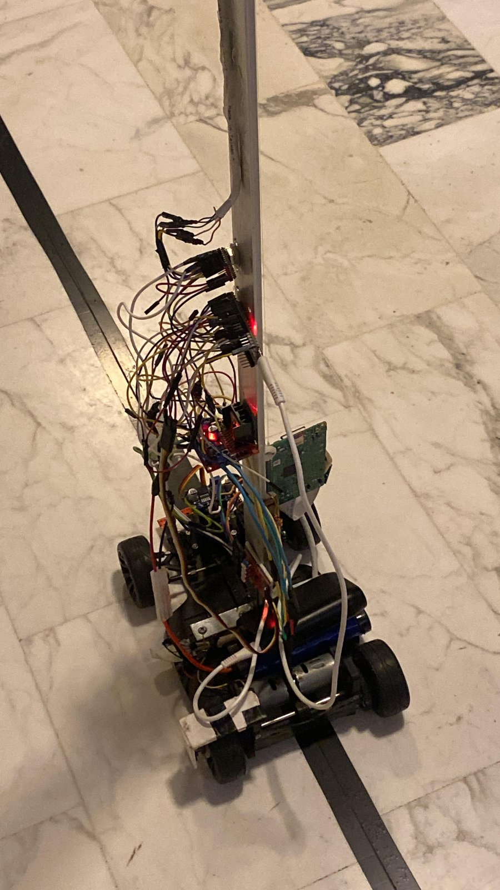
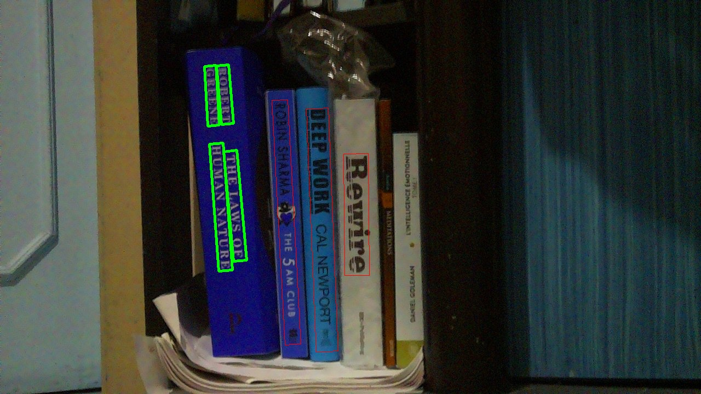
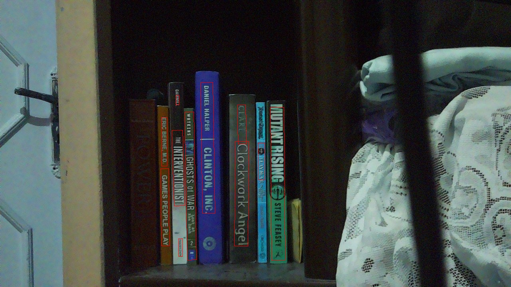
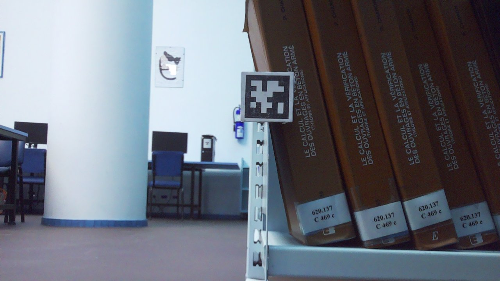

# Book-Finder Robot

A mobile robot that locates a specific book on a library shelf. Give it a photo of
the book you want; it calibrates itself against the shelf, scans every row, and
reports where the book is.

The interesting part is not that it drives — it's that it works out the shelf
geometry on its own, and that the perception pipeline has to survive a real
bookshelf: poor lighting, vertical text on curved spines, books at angles, and a
camera on a mast that flexes.

Capstone project, Lebanese University, Faculty of Engineering (Branch 1), 2026.
Built solo apart from one week early on, when a classmate tested scripts I sent
him on the hardware and wrote the first Pi camera server.



## Detection in action

Target: *The Laws of Human Nature*, Robert Greene. Green boxes are the matched
target, red boxes are other spines the OCR read successfully.



And a miss — the target was not on this shelf. Ten spines still read correctly in
a dark, cluttered scene, but no match, which is the correct outcome.



Four validation scenes are in `results/`, with the target image, the annotated
output and the console log for each.

## How it works

### Three tiers

The vision models do not fit on a Raspberry Pi, and the laptop cannot drive
motors. So the system splits across three machines:

| Device | Responsibility |
|---|---|
| **ESP32** | Motors, quadrature encoders, line sensors, steering servo, stepper mast |
| **Raspberry Pi** | Camera capture, Bluetooth bridge to the ESP32, TCP client to the laptop |
| **Laptop** | AprilTag processing, book detection, all scan decisions |

They speak a line-delimited JSON protocol with binary JPEG payloads following the
length field. The full message catalogue is in `docs/PROTOCOL_DESIGN.pdf`.

### Phase 1 — Z calibration

Shelf heights are not hardcoded. AprilTags are fixed to the right edge of each
shelf row. The mast sweeps upward while the Pi captures frames, the laptop detects
tags and computes their geometry, and the result is a stepper position for every
shelf row on *this* shelf.

Run on a different bookshelf, and it recalibrates.



### Phase 2 — Serpentine scan

Starting from the top row, the robot drives along the shelf capturing 1080p photos
every 12 cm. Twelve centimetres is deliberately less than the camera's view, so
consecutive photos overlap and no book falls in a seam. At the end of a row the
mast drops one level and the robot scans back the other way.

X position comes from the encoder count the ESP32 reports after each move, not
from the distance that was requested — the two are not the same.

### Phase 3 — Detection

Each captured photo goes to a detector that runs two things in parallel:

- **PaddleOCR** reads the spine text. Keywords from the target cover are matched
  against it with fuzzy string matching, which absorbs the errors vertical text on
  a curved spine produces. Preprocessing is white-balance correction, CLAHE
  contrast enhancement, and sharpening — without it, OCR on a dimly lit shelf
  mostly fails.
- **SigLIP2** scores overlapping vertical strips of the shelf against a prompt
  built from the same keywords, which catches books whose text the OCR misses
  entirely.

Because photos overlap, the same book is detected more than once. Hits on the same
row within a 15 cm window are merged and the higher-confidence result is kept.

The model and the camera are both held open for the whole run. Reloading either
per frame made the scan unusably slow.

## Repository layout

```
vision/          book detector, AprilTag processing, camera calibration
laptop/          scan server — owns all decisions
raspberry_pi/    camera capture, ESP32 bridge, protocol client
esp32/           motion controller, elevation controller, line follower
                 tuning_history/ — nine iterations of the drive controller
results/         validation scenes, Z sweep frames, shelf captures
docs/            protocol design, tuning log, project briefing
```

`docs/TUNING.md` records the measured hardware constants and the failures that
produced them. It is the most honest description of what this project actually
involved.

## Status

**Working and validated:** Z calibration, the perception pipeline, forward drive
with continuous line correction, the three-tier protocol.

**In hardware tuning:** reverse drive. Forward drive settled at v7 and has not
needed changing since; every version after v11 is the reverse problem. The
drivetrain is not symmetric, so reverse needs its own parameter set and the line
correction is less stable going backwards.
The robot is physically in Lebanon and I am currently in France, so this module is
paused rather than abandoned — the software is written and the remaining work is
measurement on the machine.

**Not attempted:** a quantified accuracy figure across a large book set. Four
validation scenes show the pipeline runs; they are not enough to claim a detection
rate, and I would rather report nothing than a number I cannot defend.

## Running it

Laptop:

```bash
pip install opencv-python numpy pupil-apriltags paddleocr rapidfuzz torch transformers pillow
cd laptop && python pc_server.py
```

Raspberry Pi:

```bash
pip install pyserial pillow opencv-python numpy   # picamera2 ships with Pi OS
cd raspberry_pi && python pi_client.py <laptop_ip>
```

ESP32: open `esp32/bookfinder_controller/`, install ESP32Servo and ArduinoJson,
upload, then pair with the Pi over Bluetooth and bind `/dev/rfcomm0`.

The protocol can be exercised with no hardware at all:

```bash
cd laptop && python pc_server.py
# second terminal:
cd raspberry_pi && MOCK_CAMERA=1 MOCK_ESP32=1 python pi_client.py 127.0.0.1
```

## What I'd do differently

- **No quantified validation.** The single biggest gap. A measured detection rate
  over fifty books across several shelves would make every other claim here
  stronger.
- **Scan decisions live in one large server file.** `pc_server.py` owns the state
  machine, the protocol handling and the merge logic. These should be separate.
- **`protocol.py` is duplicated** between the laptop and the Pi and the two copies
  must stay identical by hand. It should be a shared package.
- **No tests**, and the overlap-merge logic is pure computation that could easily
  have them.
- **Tuning constants are compiled into the ESP32 sketch.** Every retune meant a
  reflash. They belong in a config the Pi can push at startup.
